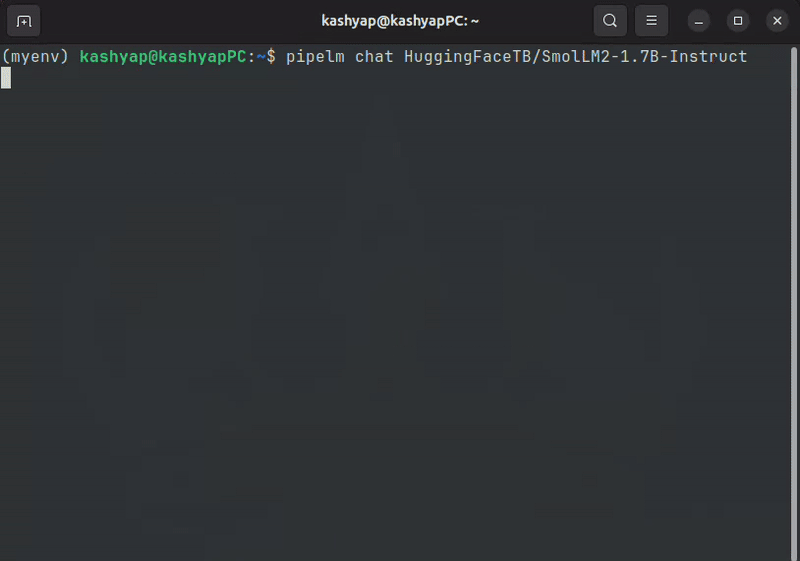

# PipeLM

*A lightweight, modular tool for running Large Language Models (LLMs) from Hugging Face.*

PipeLM provides an intuitive CLI interface for interactive chat and a robust FastAPI server to integrate LLMs seamlessly into your applications.

---

---
## Overview

PipeLM simplifies interaction with AI models, allowing you to:

- 📥 **Download and manage** models from Hugging Face.
- 🌐 **Serve models** through a standardized REST API.
- 💬 **Test prompts** via an interactive chat interface.
- 📜 **Maintain conversation history**.
- 🔄 **Easily switch models** with minimal configuration changes.

---

## Features

- **Interactive CLI Chat**: Engage directly from your terminal.
- **FastAPI Server**: REST APIs with built-in health monitoring.
- **Efficient Model Management**: Download and manage models easily.
- **Docker Support**: Containerize your models for better isolation.
- **GPU Acceleration**: Automatically utilize available GPUs.
- **Model Quantization**: Reduce memory usage (4-bit and 8-bit).
- **Conversation History**: Persistent chat context.
- **Rich Terminal Interface**: Enhanced CLI with markdown rendering.
- **Robust Error Handling**: Graceful handling of issues.

---

## Installation

### 📦 From PyPI 
```bash
pip install pipelm
```

### 💻 From Source (Recommended)
```bash
git clone https://github.com/kashyaprparmar/PipeLM
cd PipeLM
pip install -e .
```

### 🐳 With Docker
```bash
git clone https://github.com/kashyaprparmar/PipeLM
cd PipeLM

docker build -f docker/Dockerfile -t pipelm .

docker run -p 8080:8080 -v pipelm_data:/root/.pipelm -e HF_TOKEN=your_token -e MODEL_NAME=HuggingFaceTB/SmolLM2-1.7B-Instruct pipelm
```

---

## Usage

### Download a Model
```bash
pipelm download HuggingFaceTB/SmolLM2-1.7B-Instruct
```

### List Downloaded Models
```bash
pipelm list
```

### Interactive Chat
```bash
pipelm chat HuggingFaceTB/SmolLM2-1.7B-Instruct

# Using local model
pipelm chat /path/to/local/model

# With quantization
pipelm chat HuggingFaceTB/SmolLM2-1.7B-Instruct --quantize 4bit
```

### 🚀 Start API Server
```bash
pipelm server HuggingFaceTB/SmolLM2-1.7B-Instruct --port 8080

# Using local model
pipelm server /path/to/local/model --port 8080

# With quantization
pipelm server HuggingFaceTB/SmolLM2-1.7B-Instruct --quantize 8bit
```

### 🐳 Docker Compose
```bash
export HF_TOKEN=your_token
docker-compose up -d pipelm
```

---

## 📡 API Endpoints

### Quick Commands

#### Check Server Health:
```bash
curl http://localhost:8080/health
```

#### Send a Sample Prompt:
```bash
curl -X POST http://localhost:8080/generate \
  -H "Content-Type: application/json" \
  -d '{
    "messages": [{"role": "user", "content": "Explain the difference between AI and machine learning."}],
    "max_tokens": 200,
    "temperature": 0.7,
    "top_p": 0.9
  }'
```


### ✅ GET `/health`
Health status of server and model.

```json
{
  "status": "healthy",
  "model": "HuggingFaceTB/SmolLM2-1.7B-Instruct",
  "uptime": 42.5
}
```

### 📖 GET `/`
Swagger UI for API documentation.

### ✏️ POST `/generate`
Generate text from conversation history.

Request:
```json
{
  "messages": [
    {"role": "user", "content": "What is artificial intelligence?"}
  ],
  "max_tokens": 1024,
  "temperature": 0.7,
  "top_p": 0.9
}
```

Response:
```json
{
  "generated_text": "Artificial intelligence (AI) refers to the simulation of human intelligence in machines..."
}
```

---

## Chat Commands

- `/exit` or `/quit` – Exit chat
- `/clear` – Clear conversation history
- `/info` – Display current model information

---

## Environment Variables

- `HF_TOKEN`: Your Hugging Face token (required).
- `MODEL_DIR`: Local model directory.
- `PORT`: Server port (default: 8080).

---

## 📁 Project Structure
```
pipelm/
├── pipelm/                 # Main package
│   ├── __init__.py
│   ├── cli.py
│   ├── server.py
│   ├── downloader.py
│   ├── chat.py
│   └── utils.py
├── docker/                 # Docker setup
│   ├── Dockerfile
│   └── docker-compose.yml
├── setup.py
├── README.md
└── requirements.txt
```

---

## Requirements

- Python 3.8+
- Torch (GPU support recommended)
- 16+ GB RAM (model-dependent)
- CUDA-compatible GPU (recommended)

---

## Troubleshooting

### Model Download Issues

If you encounter issues downloading models:

1. Check your Hugging Face token:
   * Create or verify your token at https://huggingface.co/settings/tokens
   * Set it in your environment as `export HF_TOKEN=your_token_here`
   * Or store it in `.env` file as `HF_TOKEN=your_token_here`
2. Network issues:
   * Check your internet connection
   * Verify you have permissions to download the model

### Server Startup Issues

If the server fails to start:

1. Check if another process is using port 8080:
   * Use a different port: `pipelm server HuggingFaceTB/SmolLM2-1.7B-Instruct --port 8081`
2. Verify Python dependencies:
   * Ensure all required packages are installed: `pip install -r requirements.txt`

### Memory Issues

If you encounter memory errors:

1. Choose a smaller model
2. Try quantization: `pipelm chat HuggingFaceTB/SmolLM2-1.7B-Instruct --quantize 4bit`
3. Ensure you have enough RAM and GPU VRAM if using CUDA

## Model Storage

Models are downloaded to:
- Linux/Mac: `~/.pipelm/models/[sanitized_model_name]` OR `.local/share/pipelm/models` OR `/home/kashyap/snap/code/190/.local/share/pipelm/models`
- Windows: `C:\Users\[username]\AppData\Local\pipelm\pipelm\models\[sanitized_model_name]`

When using Docker, models are stored in `/root/.pipelm/models/` in the container, typically mapped to a persistent volume.

---

## Contributing

Contributions are welcome! Submit a Pull Request.

---

## License

MIT License. See `LICENSE` for details.
